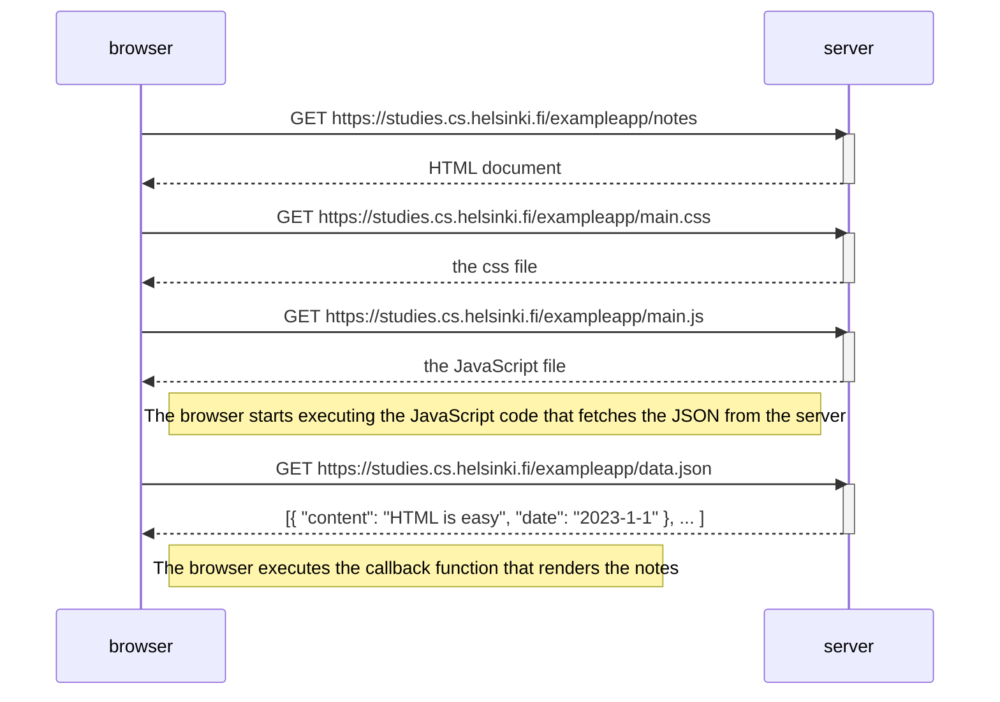
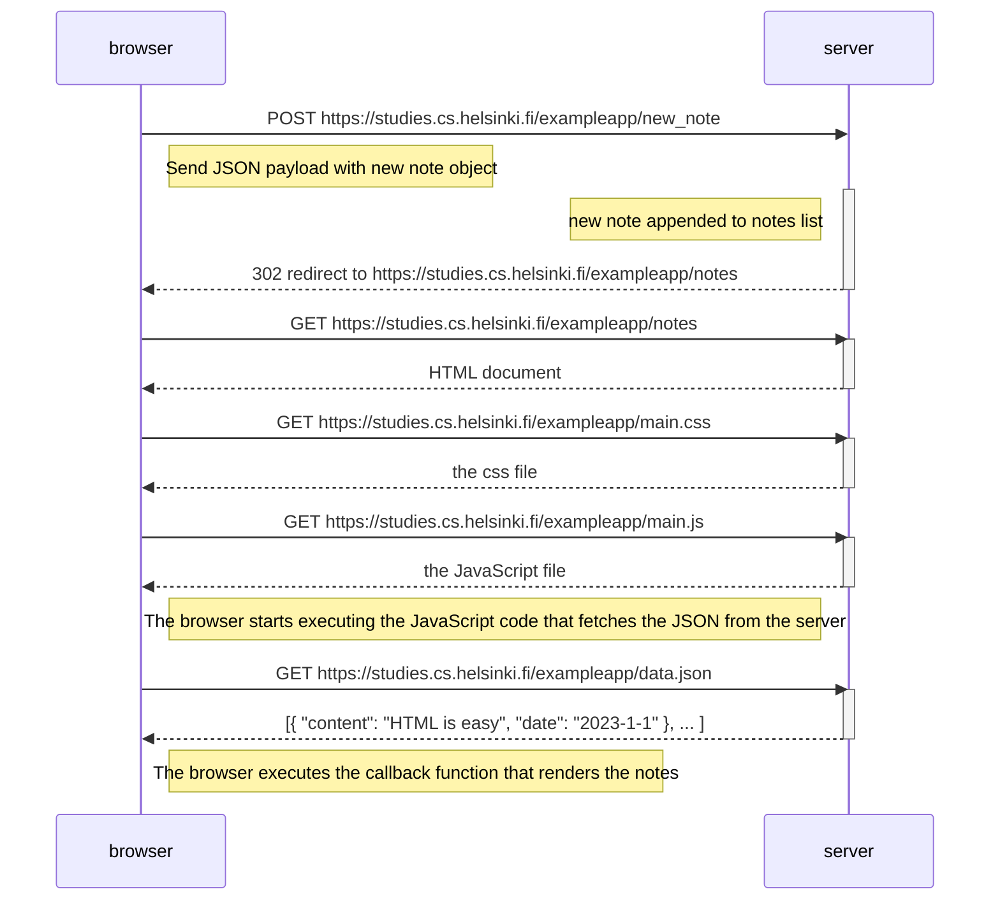

## Reading

In the section Loading a page containing JavaScript - review, the chain of events caused by opening the page https://studies.cs.helsinki.fi/exampleapp/notes is depicted as a sequence diagram

The diagram was made as a GitHub Markdown-file using the Mermaid-syntax, as follows:

## Task

Create a similar diagram depicting the situation where the user creates a new note on the page https://studies.cs.helsinki.fi/exampleapp/notes by writing something into the text field and clicking the Save button.

## Solution

The sequence diagram depicting the chain of events when a user creates a new note on the page https://studies.cs.helsinki.fi/exampleapp/notes by typing something in the form's text field and pushes the save button:

