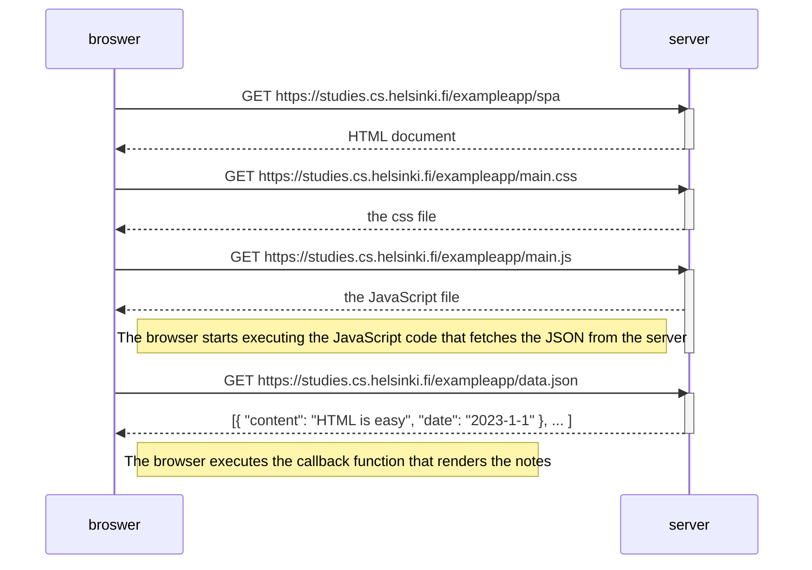

## Task

Create a diagram depicting the situation where the user goes to the single-page app version of the notes app at https://studies.cs.helsinki.fi/exampleapp/spa

## Solution

The sequence diagram depicting the chain of events when a user goes to the SPA version of the notes app at https://studies.cs.helsinki.fi/exampleapp/spa

