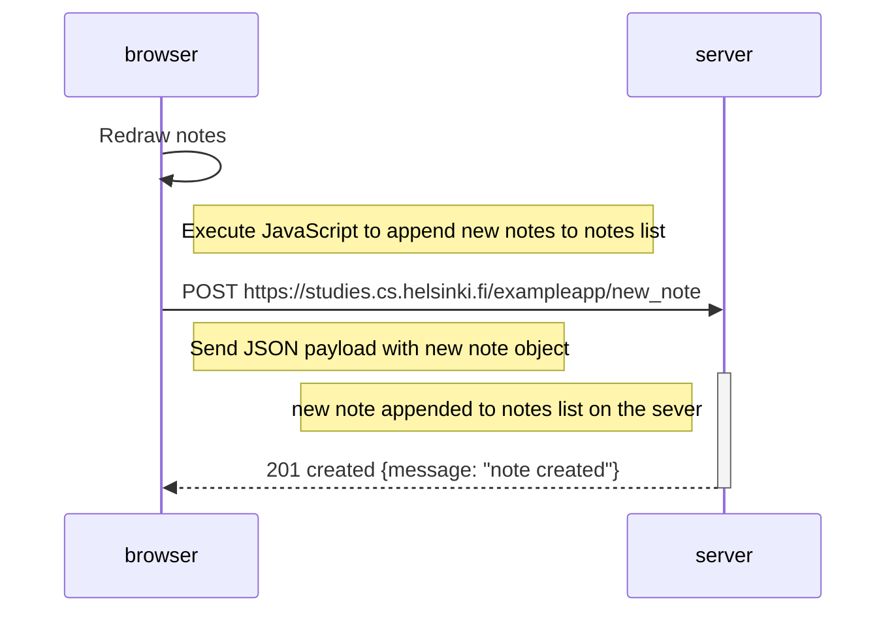

## Task

Create a diagram depicting the situation where the user creates a new note using the single-page version of the app.

## Solution

The sequence diagram depicting the chain of events when a user creates a new note by typing something in the form's text field and pushing the save button on the SPA version of the notes app at https://studies.cs.helsinki.fi/exampleapp/spa

